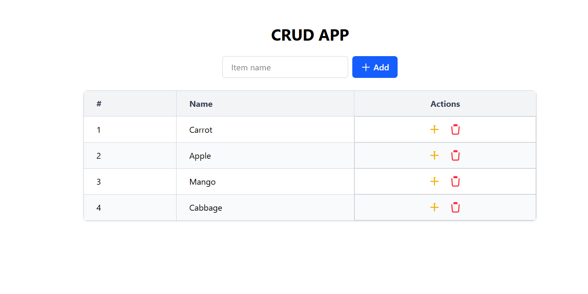
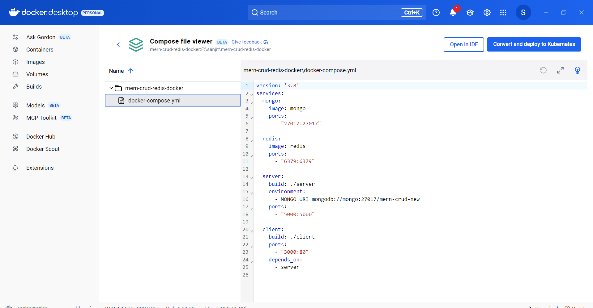

# MERN CRUD App with Redis Caching and Docker

A simple CRUD (Create, Read, Update, Delete) application built with the MERN stack (MongoDB, Express, React, Node.js) enhanced with Redis caching for performance and containerized with Docker and Docker Compose.

## Features

- **Full MERN stack:** React frontend, Node.js + Express backend.
- **MongoDB:** Stores persistent data.
- **Redis caching:** Improves read performance by caching API responses.
- **Docker \& Docker Compose:** Containerized frontend, backend, MongoDB, and Redis.
- **Vite-powered React frontend:** Lightweight and fast development environment.
- **Tailwind CSS styling:** Responsive, modern UI.
- REST API routes with proper cache invalidation on mutations.
- Easy setup and deployment.


## Screenshots

### Home / List Items
;

### Add New Item

### Edit Item

### Delete Item Confirmation
;
## Project Structure

```
mern-crud-redis-docker/
├── client/               # React frontend (Vite + Tailwind CSS)
├── server/               # Express backend with MongoDB & Redis caching
├── docker-compose.yml    # Docker Compose setup for all services
├── README.md             # Project documentation
├── .gitignore            # Git ignore files for client, server, and root
```


## Prerequisites

- Docker and Docker Compose installed on your system.
[Install Docker](https://docs.docker.com/get-docker/)
[Install Docker Compose](https://docs.docker.com/compose/install/)


## Getting Started

### 1. Clone the repository

```bash
git clone https://github.com/your-username/mern-crud-redis-docker.git
cd mern-crud-redis-docker
```


### 2. Create Environment Variables

Create a `.env` file inside the `/server` folder:

```env
MONGO_URI=mongodb://mongo:27017/mern-crud
```

> MongoDB and Redis services are defined in Docker Compose and networked internally.

### 3. Build and Run with Docker Compose

```bash
docker-compose up --build
```

Docker Compose will start 4 containers:

- MongoDB database
- Redis in-memory cache
- Node.js Express backend server on port `5000`
- React frontend served by Nginx on port `3000`


### 4. Access the Application

Open your browser and navigate to:

```
http://localhost:3000
```

You can now add, update, delete, and view items.

## Development

If you want to work on the project without Docker:

### Run Backend

```bash
cd server
npm install
npm run dev    # or node index.js
```

Make sure MongoDB and Redis are running locally or update `.env` accordingly.

### Run Frontend

```bash
cd client
npm install
npm run dev
```

Vite dev server will run at `http://localhost:3000` with proxy to backend port 5000 (set up in `vite.config.js`).

## Redis Caching Logic Overview

- GET `/api/items` requests check Redis cache first.
- If cached data exists, returns cached response.
- If not cached, fetches from MongoDB, caches it, and returns response.
- POST, PUT, DELETE requests invalidate the Redis cache to maintain consistency.


## Technologies Used

- **Frontend:** React (Vite, Tailwind CSS)
- **Backend:** Node.js, Express, Mongoose
- **Database:** MongoDB
- **Cache:** Redis
- **Containerization:** Docker, Docker Compose
- **Proxy:** nginx inside client container
- **Styling and UI:** Tailwind CSS, inline SVG icons


## Troubleshooting

- **API calls failing with 404:**
Ensure your nginx config proxies `/api` requests to backend service (`server:5000`).
- **Docker build errors:**
Check that the frontend build directory is `dist` (Vite default), and that Dockerfile paths are correct.
- **CORS issues in development:**
Use `server.proxy` in `vite.config.js` to forward `/api` calls to backend.


## License

This project is open source and available under the MIT License.

## Contribution

Contributions are welcome! Feel free to open issues or pull requests.

## Contact

For questions or support, please contact [your-email@example.com].

*Happy coding!* 🚀

